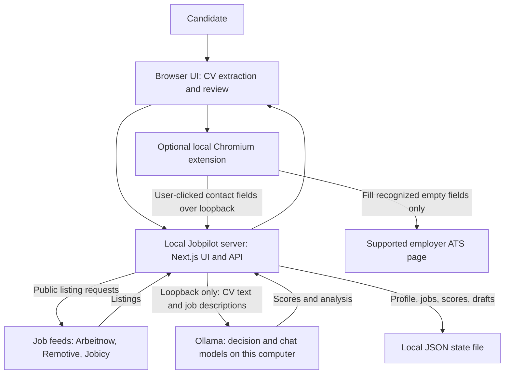
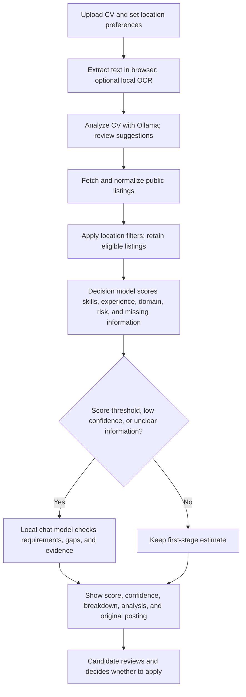
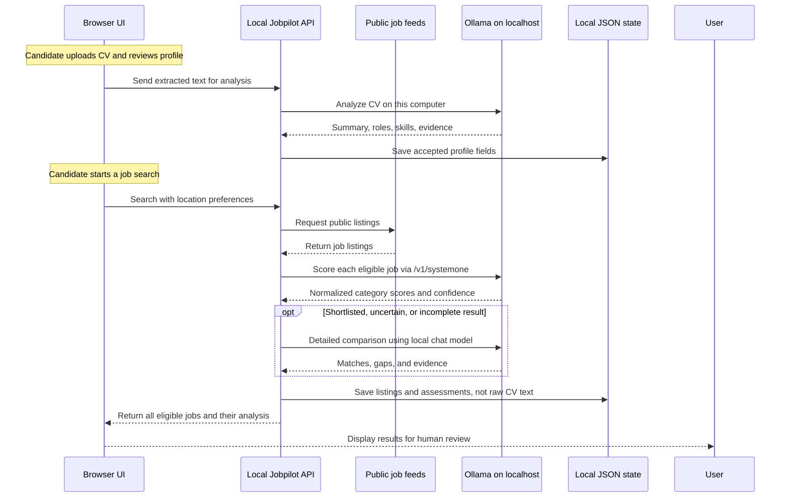

# Jobpilot

Jobpilot is a job-search helper that runs on your computer. It finds public job listings, compares them with your CV using Ollama (a local AI app), and helps you prepare application drafts. You review every result and submit applications yourself.

## Get started (no coding experience needed)

Follow these steps in order. You only need to do the setup once.

### 1. Install Node.js

Download and install **Node.js 22.13 or newer** from [nodejs.org](https://nodejs.org/). Choose the regular installer for your computer and accept the suggested options. If the installer asks, allow it to install npm too. Restart your computer if the installer asks you to.

### 2. Download Jobpilot

1. Open the [Jobpilot GitHub page](https://github.com/sinariazi/jobpilot).
2. Click the green **Code** button, then **Download ZIP**.
3. Open your Downloads folder and extract/unzip the downloaded file. You should now have a folder named `jobpilot-main`.

### 3. Install Ollama for local AI

1. Download Ollama from [ollama.com/download](https://ollama.com/download) and install it.
2. Open the Ollama app and leave it running while you use Jobpilot.
3. Open a second terminal window (or PowerShell on Windows) and run the following two commands, one at a time. The first downloads the chat model for CV analysis, detailed job comparison, and writing drafts. The second downloads a small decision model for quickly screening many jobs:

   ```bash
   ollama pull qwen3.5:4b
   ollama pull tev1:0.8b
   ```

   Ollama downloads the models onto your computer. This can take several minutes and needs about 4 GB for the chat model and 0.8 GB for the small decision model, plus extra space for Ollama. Keep the Ollama app running while Jobpilot is open.
4. Update Ollama to version **0.35 or newer** for `/v1/systemone` decision screening. `tev1:0.8b` is the smaller decision-model option; `tev1:4b` is the larger 4B option if your computer has more memory (install it with `ollama pull tev1:4b`). A chat model cannot replace the decision model, and a decision model is not a chat model. Jobpilot suggests a separate installed tag whose name indicates decision/System One use; confirm or change it in **Local AI status**. If no suggestion appears, choose the installed decision model yourself.
5. To use different models, open the [Ollama model library](https://ollama.com/library), choose a chat model that suits your computer, then run `ollama pull MODEL_NAME` using the exact command on its page. For another compatible decision model, use its exact Ollama library tag too. Do not paste the words `MODEL_NAME` literally.

### 4. Open a terminal in the Jobpilot folder

The terminal is an app where you paste the commands below.

- **Windows:** Open the extracted `jobpilot-main` folder in File Explorer. Click the address bar, type `powershell`, then press **Enter**.
- **Mac:** Open **Applications → Utilities → Terminal**, type `cd ~/Downloads/jobpilot-main`, then press **Enter**. If you extracted the folder somewhere else, use that folder's location instead.
- **Linux:** Open Terminal and go to the extracted folder. For the default Downloads location, type `cd ~/Downloads/jobpilot-main` and press **Enter**.

### 5. Install and start Jobpilot

In that terminal window, run these commands one at a time. Press **Enter** after each command and wait for it to finish:

```bash
npm install
npm run dev
```

Keep this terminal window open. When it says the server is ready, open [http://localhost:3000](http://localhost:3000) in your web browser. Jobpilot is now running on your computer.

### 6. Set up your profile and find jobs

1. In Jobpilot, click **Candidate profile**.
2. Under **Analyze CV**, choose your CV file (PDF, DOCX, or TXT). For a scanned PDF, see [Scanned CVs](#scanned-cvs-optional).
3. Review the CV summary, suggested job titles, and skills. Edit anything that is incorrect. Enter your preferred locations (for example, `Austria`) and click **Save profile**.
4. In **Local AI status**, confirm `qwen3.5:4b` is selected for detailed analysis and `tev1:0.8b` for decision screening. Jobpilot suggests these from the installed model names after Ollama finishes downloading; if the decision model is not suggested, choose it from the list. Refresh the status if a model is missing.
5. On the main page, review or edit the CV-suggested **Job titles** and set **Preferred locations**. Click **Search jobs**. Jobpilot shows the first result pool immediately, scores eligible listings in small batches, and displays each score as it finishes. It then automatically checks up to three additional provider batches while keeping current results visible; use **Load more jobs** to continue beyond that bounded automatic search. Jobs above the score threshold and low-confidence/uncertain jobs also go to the detailed model when it is installed. You do not need to click a separate matching button. The progress indicator reports listings found, decision scores completed, and detailed reviews completed. Successful feed results remain visible if another source fails. Select a result to read its available description, evidence, attribution, and original posting link.
6. If a public feed misses a posting, open **Add a job manually** and paste its description. An optional URL is saved as the source link but is not fetched; some employer sites block automated access or require an account.

### Optional: fill basic employer form fields locally

The Chromium extension works with **Chrome and Edge** on Greenhouse, Lever, Ashby, Workday, SmartRecruiters, and Workable application pages. It reads your saved contact details from Jobpilot on `localhost`. When you click **Fill empty fields**, those values are inserted into the employer's page, where that employer can read them as usual. No data goes to a Jobpilot-hosted service.

1. Keep Jobpilot running at [http://localhost:3000](http://localhost:3000), then open `chrome://extensions` in Chrome or `edge://extensions` in Edge.
2. Turn on **Developer mode** and select **Load unpacked**.
3. Select the `extension/chromium` folder inside the Jobpilot folder you downloaded.
4. Open an application form on a supported ATS, click the Jobpilot extension icon, then click **Fill empty fields**.
5. Review every filled value and complete the employer's questions yourself. Jobpilot never uploads a CV, fills screening questions, or submits the form.

The extension fills only recognized, empty name and contact fields and a saved cover-letter field when the current posting matches a saved Jobpilot job. It does not overwrite existing values or interact with file uploads, checkboxes, passwords, or submit buttons. Reload an application page if you installed the extension while that page was already open. Remove it from the browser extensions page when you no longer need it.

To use Jobpilot another day, open Ollama, open a terminal in the `jobpilot-main` folder, run `npm run dev`, and visit [http://localhost:3000](http://localhost:3000). To stop Jobpilot, focus the terminal window and press **Ctrl+C**. Your profile and saved job tracker remain on this computer.

## If something goes wrong

- **`npm` is not recognized / command not found:** Install Node.js from [nodejs.org](https://nodejs.org/), close and reopen the terminal, then try again.
- **The page does not open:** Make sure the terminal is still running `npm run dev`, then refresh `http://localhost:3000`.
- **No Ollama models appear:** Open the Ollama app, install a model, and refresh Jobpilot. To check installed models, run `ollama ls` in a terminal.
- **Decision screening returns an error:** Update Ollama to 0.35 or newer, confirm `tev1:0.8b` appears in the output of `ollama ls`, and select it under **Decision model for first-stage screening**. The decision model is separate from the chat model. If it still fails, restart Ollama and refresh **Local AI status**. Jobpilot does not send your CV or job text to a hosted AI service instead.
- **Detailed analysis or cover-letter drafting fails:** Confirm `qwen3.5:4b` appears in `ollama ls`, then select it under **Detailed analysis and drafting model**. If your computer has limited memory, choose a smaller chat model from the Ollama library and install it with the exact `ollama pull ...` command shown there.
- **No jobs appear:** Check the source status and error beside the results. Broaden selected locations or titles, or try again later; these feeds do not cover every Austrian employer. You can paste a listing's description under **Add a job manually**. Jobpilot does not fetch optional posting URLs because access may be blocked or restricted.
- **Only one feed failed:** Successful listings remain available. Read the source-specific status and try the search again later. Each source shows how many listings it returned and how many matched the selected title/location filters. Temporary Arbeitnow HTTP 429/5xx errors are retried once; partial batches advance past persistent failed pages so later pages can still load. Provider outages and changing public API behavior can temporarily reduce results.
- **Model takes a long time or fails:** Try a smaller model that fits your computer's memory. Jobpilot can still show fetched jobs without AI scores.
- **Need help with the command window?** Leave the message visible and share the exact error text when asking for help. Do not share your CV or personal profile data.

## What Jobpilot does

- Searches three public feeds automatically; no company names, ATS slugs, API keys, paid plans, or accounts are needed. Coverage is limited and is not comprehensive for Austria. Listings are real provider results; no sample jobs are inserted.
- **Arbeitnow:** Public paginated JSON API, no key. Primarily Germany with some Europe-wide listings; fields include title, employer, location, remote flag, types, description, date, and source URL. The provider publishes no freshness guarantee. A backlink is required and access may be revoked. Jobpilot fetches at most five pages per search and continues when the API provides a valid next link. [API](https://www.arbeitnow.com/api) · [terms](https://www.arbeitnow.com/terms).
- **Remotive:** Public JSON API, no key. Remote roles with candidate eligibility text, not local office coverage. Provides title, employer, required-location text, type, category, HTML description, date, and listing URL. Listings are delayed 24 hours; Jobpilot caches the response for six hours and limits fetching to the initial search. Remotive requests attribution and the feed must not be reposted as a third-party job board. [API and terms](https://github.com/remotive-io/remote-jobs-api).
- **Jobicy:** Public JSON API and location taxonomy, no key or registration. Remote roles with geo eligibility; the public feed covers a rolling seven-day window with a three-hour publication delay and cursor continuation. Provides title, employer, geography, type, industry, description, date, and Jobicy URL. Jobpilot caches location taxonomy for 24 hours and job results for one hour, and queries at most five selected provider regions per request. Preserve source attribution and avoid excessive requests. [API](https://jobicy.com/jobs-rss-feed) · [terms](https://jobicy.com/terms).
- Search requests enabled feeds concurrently and keeps both the deduplicated provider pool and the filtered job-match pool. The **All found jobs** workspace tab shows every listing returned by the providers before Jobpilot applies title/location filters, including whether each listing passes those preferences; some providers still apply their own search scope, such as Jobicy's selected-region query. **Job matches** stays filtered and is the only pool sent to local screening. Results become visible before scoring is complete; local scores and detailed shortlists update in batches. Jobpilot automatically fetches up to three continuation batches; later pages remain user-loadable to limit unnecessary requests. Up to 2,000 most recently held listings are retained in local state. Austria-wide discovery cannot be comprehensive under the free, public-feed constraint: the enabled sources are mainly remote or Germany/Europe focused, and many Austrian employer ATS endpoints are not searchable as a universal public feed. Search the public feeds and use the optional pasted-description fallback for known listings that are missing.
- Loads further pages from Arbeitnow and Jobicy when their APIs return a next-page link or cursor. Remotive's [public API](https://github.com/remotive-io/remote-jobs-api) returns its active result set in one response and currently documents no page or cursor parameter, so Jobpilot fetches that feed once per cache period rather than inventing pagination.
- Filters by the editable locations in your profile (Austria is the suggested default where applicable). Leave locations blank only if you want any location. Generic “Remote” does not imply Austria eligibility unless the feed provides evidence or you explicitly choose Remote. Jobicy's Europe feed is checked against the selected Europe scope.
- Uses local Ollama `/v1/systemone` decision screening (default setup suggestion: `tev1:0.8b`) for a fast first estimate, then a local chat model (default setup suggestion: `qwen3.5:4b`) for shortlisted, uncertain, or incomplete cases. Both model names can be changed in the UI. You can adjust score weights and detailed-analysis thresholds in the app. Scores are estimates, not hiring probabilities. All location-eligible jobs remain visible, including low-scoring jobs; load additional provider pages when available.
- The default score weights are skills 40%, experience 30%, domain fit 20%, and penalty for explicit disqualifiers 10%. Detailed analysis runs by default at scores of 65 or higher, confidence below 60, or whenever important information is missing/unclear. Change these settings in Jobpilot; the score is not a probability of being hired.
- Shows score breakdowns, confidence when the model provides it, missing information, and detailed matched requirements/gaps with source evidence when available. Verify every result against the original listing.
- Lets you save jobs, track application status, add private notes and follow-up dates, and create editable cover-letter drafts. A local Chrome/Edge extension can fill recognized empty contact fields and a matching saved cover-letter draft on Greenhouse, Lever, Ashby, Workday, SmartRecruiters, and Workable forms. Add contact details in **Candidate profile**. You review all fields and submit applications yourself; the extension does not upload CVs or answer employer screening questions.
- Stores profile and job-tracker data on this device in `~/.jobpilot/state.json` (or the folder set by `JOBPILOT_DATA_DIR`). The file is not encrypted. Use **Candidate profile → Data backup** to save or restore a local backup.

## CV privacy and local AI

The CV file is read in your browser and is not saved by Jobpilot. Extracted CV text is held in memory and sent to Ollama on this same computer for CV analysis and job matching. Job descriptions used for matching are also sent only to local Ollama. Jobpilot has no hosted AI fallback. Public feeds do not receive candidate profile data. Extracted role and skill suggestions, AI scores/explanations, review labels, profile fields, and tracker data are stored locally; the stored data is not encrypted. Cover-letter generation sends the job details, profile name and skills, and notes you enter to local Ollama, but not the full CV text. Keep Jobpilot bound to `localhost`; do not expose it to your network.

Job discovery needs an internet connection. AI matching needs Ollama and installed models. The model's speed and quality depend on the model and your computer. User-reviewed match feedback is a selected sample and does not establish general accuracy or calibration.

### Scanned CVs (optional)

Text-based PDF, DOCX, and TXT CVs work without extra OCR software. Scanned PDFs need Tesseract OCR installed on the computer. On macOS with Homebrew, open Terminal and run:

```bash
brew install tesseract tesseract-lang
```

Restart Jobpilot and choose English, German, or both in the CV upload section. The browser renders pages and sends them only to Jobpilot on localhost; Tesseract processes temporary local image files, which are deleted after OCR. Up to 20 scanned pages are supported. If Tesseract is not installed, text-based CV extraction continues to work.

## Current limitations (TODO)

- Broaden location/country normalization beyond the current common city aliases and English/German feed formats.
- Improve free Austria-wide discovery if a public, no-key, no-registration job source with permitted access becomes available; the current sources cannot provide comprehensive local coverage.
- Encrypt local profile, tracker, and backup data.
- Tailor and export a CV from verified source material; currently Jobpilot analyzes CVs but does not generate tailored CV files.
- Improve cover-letter drafting preferences, structured output, and source-to-claim checks.
- Review accessibility and responsive layouts across supported browsers and screen sizes.
- Add end-to-end tests for job search, job details, profile, tracking, and extension prefill on live ATS pages. Automated extension tests currently cover supported hosts, field mapping, and local access controls only.
- Evaluate local decision scores against a real human-reviewed set of strong, borderline, and poor matches. No such reviewed dataset is currently available, so false-positive/false-negative rates and model calibration have not been established.

## For developers

Requirements: Node.js 22.13 or newer and npm.

```bash
npm install
npm run dev
```

Useful checks:

```bash
npm run lint
npm run typecheck
npm test
npm run build
```

GitHub Actions runs these checks on pushes and pull requests. Public feed endpoints and test fixtures are integration/test data; the repository contains no real CV or personal candidate profile. Do not commit CVs, personal job-search data, credentials, or `.env` files.

## Solution architecture showcase

Jobpilot is designed as a single-user, local-first application. The browser handles CV file reading and text extraction; a local Next.js server coordinates job feeds, profile analysis, matching, and persistence. Ollama performs inference on the same computer. The optional Chromium extension reads only application fields from Jobpilot's local endpoint after the user clicks its fill button. Public providers supply job listings and do not receive candidate profile or CV data.

### System context and trust boundaries



The CV file is not stored. Extracted text stays in memory for analysis and matching; only accepted profile fields and job results are persisted. Scanned-page OCR uses local Tesseract through the localhost app. The local state file and backups are currently unencrypted, as listed in TODO.

### Job-search and two-stage matching flow



Default screening weights are 40% skills, 30% experience, 20% domain fit, and 10% inverse explicit-disqualifier risk. The default detailed-analysis route is a score of 65 or higher, confidence below 60, or missing/unclear information. Users can change these values in the app. Scores are estimates, not hiring probabilities; the local model's accuracy has not been established on a human-reviewed benchmark.

### Runtime interaction



### Key architecture decisions

| Decision | Why it fits this application | Trade-off or current boundary |
|---|---|---|
| Keep orchestration in the local Next.js application | One installable TypeScript project serves the UI and local APIs without a separate hosted backend. | The app is a single-user local tool, not a multi-user service. |
| Use adapters to map provider listings into a shared job type | Feed-specific fields are normalized before location filtering, display, and matching. | Coverage and pagination depend on each provider's public API and terms. |
| Split matching into a fast decision stage and a detailed stage | A lightweight estimate can screen many listings; slower evidence-focused analysis is reserved for selected or uncertain cases. | Both stages depend on local model compatibility, hardware, and model quality. |
| Keep CV and contact data away from job-feed providers and hosted AI | CV text goes only to Ollama on loopback; the extension fetches selected contact fields locally after a user click. | The ATS receives values filled into its page; job discovery needs internet, and local JSON data is not encrypted. |
| Preserve human review and show estimates separately | Scores, confidence, and detailed analysis remain distinguishable; original postings stay available. | The agent does not submit applications, and score calibration awaits reviewed examples. |

This design demonstrates local data-boundary design, integration of heterogeneous APIs, explicit decision routing, failure-aware AI orchestration, and human-in-the-loop workflow design. Remaining boundaries—encryption, broader feed coverage, ATS-specific questions and uploads, and measured score accuracy—are documented in [Current limitations](#current-limitations-todo).
