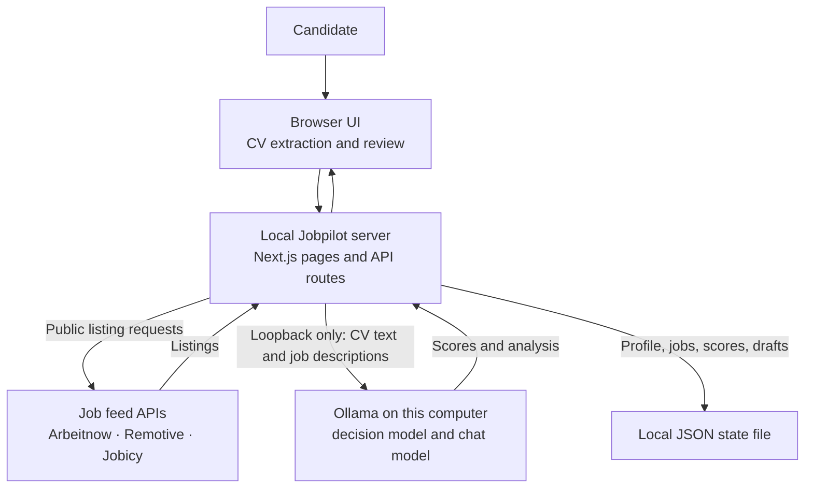
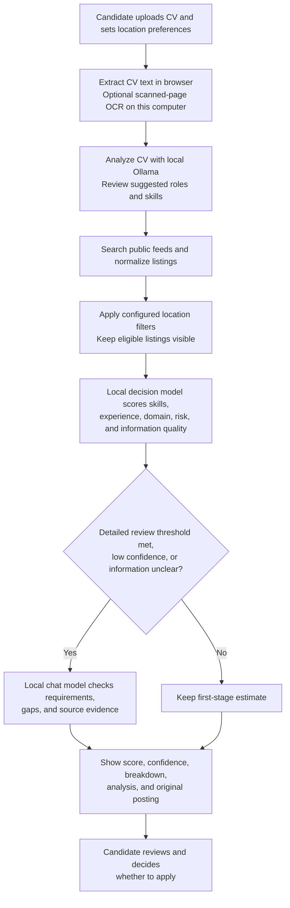
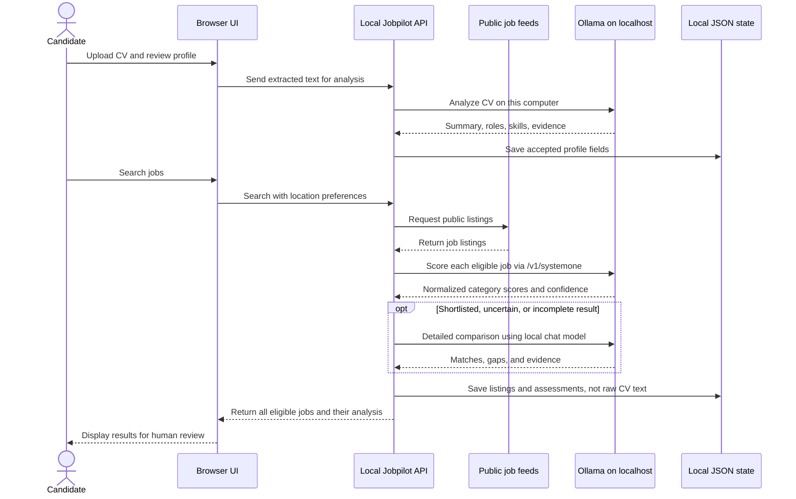

# Jobpilot

Jobpilot is a job-search helper that runs on your computer. It finds public job listings, compares them with your CV using Ollama (a local AI app), and helps you prepare application drafts. You review every result and submit applications yourself.

## Get started (no coding experience needed)

Follow these steps in order. You only need to do the setup once.

### 1. Install Node.js

Download and install **Node.js 22.13 or newer** from [nodejs.org](https://nodejs.org/). Choose the regular installer for your computer and accept the suggested options. If the installer asks, allow it to install npm too. Restart your computer if the installer asks you to.

### 2. Download Jobpilot

1. Open the [Jobpilot GitHub page](https://github.com/sinariazi/jobpilot).
2. Click the green **Code** button, then **Download ZIP**.
3. Open your Downloads folder and extract/unzip the downloaded file. You should now have a folder named `jobpilot-main`.

### 3. Install Ollama for local AI

1. Download Ollama from [ollama.com/download](https://ollama.com/download) and install it.
2. Open the Ollama app and leave it running while you use Jobpilot.
3. Install a local chat model from the [Ollama model library](https://ollama.com/library). For example, open the model's page, follow its **CLI** instructions, and run the shown `ollama pull ...` command in a terminal. Models take disk space and may take several minutes to download.
4. For automatic CV-to-job scoring, also install a model that Ollama documents as compatible with its `/v1/systemone` decision endpoint. This feature requires Ollama 0.35 or newer. If you skip this, you can still browse jobs, but automatic decision-model scores will not be available.

### 4. Open a terminal in the Jobpilot folder

The terminal is an app where you paste the commands below.

- **Windows:** Open the extracted `jobpilot-main` folder in File Explorer. Click the address bar, type `powershell`, then press **Enter**.
- **Mac:** Open **Applications → Utilities → Terminal**, type `cd ~/Downloads/jobpilot-main`, then press **Enter**. If you extracted the folder somewhere else, use that folder's location instead.
- **Linux:** Open Terminal and go to the extracted folder. For the default Downloads location, type `cd ~/Downloads/jobpilot-main` and press **Enter**.

### 5. Install and start Jobpilot

In that terminal window, run these commands one at a time. Press **Enter** after each command and wait for it to finish:

```bash
npm install
npm run dev
```

Keep this terminal window open. When it says the server is ready, open [http://localhost:3000](http://localhost:3000) in your web browser. Jobpilot is now running on your computer.

### 6. Set up your profile and find jobs

1. In Jobpilot, click **Candidate profile**.
2. Under **Analyze CV**, choose your CV file (PDF, DOCX, or TXT). For a scanned PDF, see [Scanned CVs](#scanned-cvs-optional).
3. Review the CV summary, suggested job titles, and skills. Edit anything that is incorrect. Enter your preferred locations (for example, `Austria`) and click **Save profile**.
4. In **Local AI status**, choose the Ollama chat model you installed. If available, choose a compatible decision model too. Jobpilot discovers models installed on your computer.
5. Go back to the main page and click **Search jobs**. Wait for the feeds and local AI to finish. Select a result to read its details, evidence, and original job posting.

To use Jobpilot another day, open Ollama, open a terminal in the `jobpilot-main` folder, run `npm run dev`, and visit [http://localhost:3000](http://localhost:3000). To stop Jobpilot, focus the terminal window and press **Ctrl+C**. Your profile and saved job tracker remain on this computer.

## If something goes wrong

- **`npm` is not recognized / command not found:** Install Node.js from [nodejs.org](https://nodejs.org/), close and reopen the terminal, then try again.
- **The page does not open:** Make sure the terminal is still running `npm run dev`, then refresh `http://localhost:3000`.
- **No Ollama models appear:** Open the Ollama app, install a model, and refresh Jobpilot. To check installed models, run `ollama ls` in a terminal.
- **Decision screening is unavailable:** Update Ollama to 0.35 or newer and select a model compatible with `/v1/systemone`. A chat model may not support decision screening. Jobpilot shows an error and does not send your CV or job text to a hosted AI service instead.
- **Model takes a long time or fails:** Try a smaller model that fits your computer's memory. Jobpilot can still show fetched jobs without AI scores.
- **Need help with the command window?** Leave the message visible and share the exact error text when asking for help. Do not share your CV or personal profile data.

## What Jobpilot does

- Searches public job feeds automatically; you do not need to enter company names or board slugs. Public feeds do not include every vacancy.
- Filters by locations in your profile. Leave preferred locations blank only if you want jobs from any location. A generic “Remote” listing is not assumed to be available in Austria unless the listing/feed indicates it.
- Uses local Ollama `/v1/systemone` decision screening for a fast first estimate, then a local chat model for shortlisted, uncertain, or incomplete cases. You can adjust score weights and detailed-analysis thresholds in the app. Scores are estimates, not hiring probabilities. Low-scoring jobs remain visible.
- The default score weights are skills 40%, experience 30%, domain fit 20%, and penalty for explicit disqualifiers 10%. Detailed analysis runs by default at scores of 65 or higher, confidence below 60, or whenever important information is missing/unclear. Change these settings in Jobpilot; the score is not a probability of being hired.
- Shows score breakdowns, confidence when the model provides it, missing information, and detailed matched requirements/gaps with source evidence when available. Verify every result against the original listing.
- Lets you save jobs, track application status, add private notes and follow-up dates, and create editable cover-letter drafts. It never submits an application.
- Stores profile and job-tracker data on this device in `~/.jobpilot/state.json` (or the folder set by `JOBPILOT_DATA_DIR`). The file is not encrypted. Use **Candidate profile → Data backup** to save or restore a local backup.

## CV privacy and local AI

The CV file is read in your browser and is not saved by Jobpilot. Extracted CV text is held in memory and sent to Ollama on this same computer for CV analysis and job matching. Job descriptions used for matching are also sent only to local Ollama. Jobpilot has no hosted AI fallback and does not send candidate data to job-feed providers. Extracted role and skill suggestions, AI scores/explanations, review labels, profile fields, and tracker data are stored locally; the stored data is not encrypted. Cover-letter generation sends the job details, profile name and skills, and notes you enter to local Ollama, but not the full CV text. Keep Jobpilot bound to `localhost`; do not expose it to your network.

Job discovery needs an internet connection. AI matching needs Ollama and installed models. The model's speed and quality depend on the model and your computer. User-reviewed match feedback is a selected sample and does not establish general accuracy or calibration.

### Scanned CVs (optional)

Text-based PDF, DOCX, and TXT CVs work without extra OCR software. Scanned PDFs need Tesseract OCR installed on the computer. On macOS with Homebrew, open Terminal and run:

```bash
brew install tesseract tesseract-lang
```

Restart Jobpilot and choose English, German, or both in the CV upload section. The browser renders pages and sends them only to Jobpilot on localhost; Tesseract processes temporary local image files, which are deleted after OCR. Up to 20 scanned pages are supported. If Tesseract is not installed, text-based CV extraction continues to work.

## Current limitations (TODO)

- Broaden location/country normalization and cover more languages and inconsistent feed formats.
- Add a licensed job provider with broader employer and geography coverage, after checking provider terms.
- Add Remotive and Jobicy pagination where their public APIs allow it. Arbeitnow pagination is available through **Load more jobs**.
- Encrypt local profile, tracker, and backup data.
- Tailor and export a CV from verified source material; currently Jobpilot analyzes CVs but does not generate tailored CV files.
- Add application-form preparation and employer-specific ATS support; Jobpilot currently opens original postings but does not fill external forms.
- Improve cover-letter drafting preferences, structured output, and source-to-claim checks.
- Review accessibility and responsive layouts across supported browsers and screen sizes.
- Add end-to-end tests for job search, job details, profile, and tracking.
- Evaluate local decision scores against a real human-reviewed set of strong, borderline, and poor matches. No such reviewed dataset is currently available, so false-positive/false-negative rates and model calibration have not been established.

## For developers

Requirements: Node.js 22.13 or newer and npm.

```bash
npm install
npm run dev
```

Useful checks:

```bash
npm run lint
npm run typecheck
npm test
npm run build
```

GitHub Actions runs these checks on pushes and pull requests. Public feed endpoints and test fixtures are integration/test data; the repository contains no real CV or personal candidate profile. Do not commit CVs, personal job-search data, credentials, or `.env` files.

## Solution architecture showcase

Jobpilot is designed as a single-user, local-first application. The browser handles CV file reading and text extraction; a local Next.js server coordinates job feeds, profile analysis, matching, and persistence. Ollama performs inference on the same computer. Public providers supply job listings, but do not receive candidate profile or CV data.

### System context and trust boundaries



The CV file is not stored. Extracted text stays in memory for analysis and matching; only accepted profile fields and job results are persisted. Scanned-page OCR uses local Tesseract through the localhost app. The local state file and backups are currently unencrypted, as listed in TODO.

### Job-search and two-stage matching flow



Default screening weights are 40% skills, 30% experience, 20% domain fit, and 10% inverse explicit-disqualifier risk. The default detailed-analysis route is a score of 65 or higher, confidence below 60, or missing/unclear information. Users can change these values in the app. Scores are estimates, not hiring probabilities; the local model's accuracy has not been established on a human-reviewed benchmark.

### Runtime interaction



### Key architecture decisions

| Decision | Why it fits this application | Trade-off or current boundary |
|---|---|---|
| Keep orchestration in the local Next.js application | One installable TypeScript project serves the UI and local APIs without a separate hosted backend. | The app is a single-user local tool, not a multi-user service. |
| Use adapters to map provider listings into a shared job type | Feed-specific fields are normalized before location filtering, display, and matching. | Coverage and pagination depend on each provider's public API and terms. |
| Split matching into a fast decision stage and a detailed stage | A lightweight estimate can screen many listings; slower evidence-focused analysis is reserved for selected or uncertain cases. | Both stages depend on local model compatibility, hardware, and model quality. |
| Keep candidate data away from job-feed providers and hosted AI | Candidate text goes only to Ollama on loopback; feed requests retrieve public listings. | Job discovery still requires an internet connection, and local JSON data is not encrypted. |
| Preserve human review and show estimates separately | Scores, confidence, and detailed analysis remain distinguishable; original postings stay available. | The agent does not submit applications, and score calibration awaits reviewed examples. |

This design demonstrates local data-boundary design, integration of heterogeneous APIs, explicit decision routing, failure-aware AI orchestration, and human-in-the-loop workflow design. Remaining boundaries—encryption, broader feed coverage, ATS integration, and measured score accuracy—are documented in [Current limitations](#current-limitations-todo).
