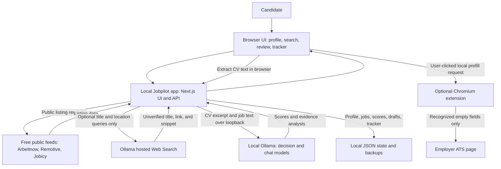
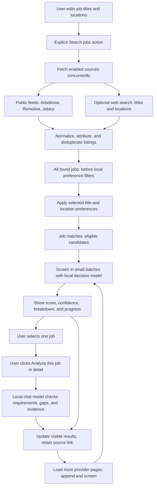
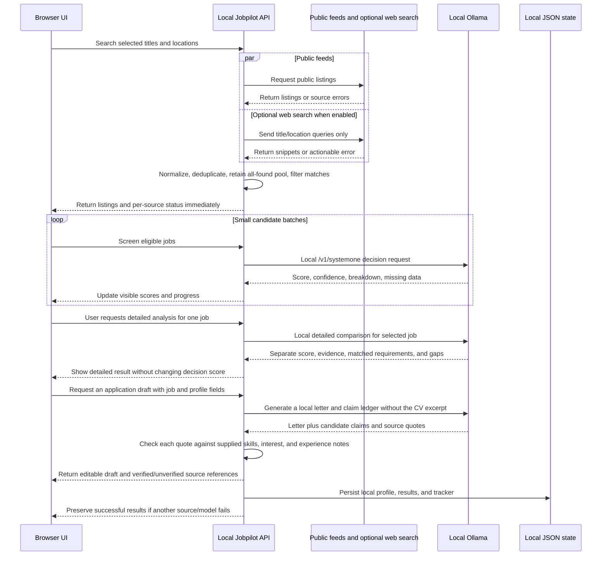

# Jobpilot

Jobpilot is a job-search helper that runs on your computer. It finds public job listings, compares them with your CV using Ollama (a local AI app), and helps you prepare application drafts. You review every result and submit applications yourself.

## Get started (no coding experience needed)

Follow these steps in order. You only need to do the setup once.

### 1. Install Node.js

Download and install **Node.js 22.13 or newer** from [nodejs.org](https://nodejs.org/). Choose the regular installer for your computer and accept the suggested options. If the installer asks, allow it to install npm too. Restart your computer if the installer asks you to.

### 2. Download Jobpilot

1. Open the [Jobpilot GitHub page](https://github.com/sinariazi/jobpilot).
2. Click the green **Code** button, then **Download ZIP**.
3. Open your Downloads folder and extract/unzip the downloaded file. You should now have a folder named `jobpilot-main`.

### 3. Install Ollama for local AI

1. Download Ollama from [ollama.com/download](https://ollama.com/download) and install it.
2. Open the Ollama app and leave it running while you use Jobpilot.
3. Open a second terminal window (or PowerShell on Windows) and run the following two commands, one at a time. The first downloads the chat model for CV analysis, detailed job comparison, and writing drafts. The second downloads a small decision model for quickly screening many jobs:

   ```bash
   ollama pull qwen3.5:4b
   ollama pull tev1:0.8b
   ```

   Ollama downloads the models onto your computer. This can take several minutes and needs about 4 GB for the chat model and 0.8 GB for the small decision model, plus extra space for Ollama. Keep the Ollama app running while Jobpilot is open.
4. Update Ollama to version **0.35 or newer** for `/v1/systemone` decision screening. `tev1:0.8b` is the smaller decision-model option; `tev1:4b` is the larger 4B option if your computer has more memory (install it with `ollama pull tev1:4b`). A chat model cannot replace the decision model, and a decision model is not a chat model. Jobpilot suggests a separate installed tag whose name indicates decision/System One use; confirm or change it in **Local AI status**. If no suggestion appears, choose the installed decision model yourself.
5. To use different models, open the [Ollama model library](https://ollama.com/library), choose a chat model that suits your computer, then run `ollama pull MODEL_NAME` using the exact command on its page. For another compatible decision model, use its exact Ollama library tag too. Do not paste the words `MODEL_NAME` literally.

### 4. Open a terminal in the Jobpilot folder

The terminal is an app where you paste the commands below.

- **Windows:** Open the extracted `jobpilot-main` folder in File Explorer. Click the address bar, type `powershell`, then press **Enter**.
- **Mac:** Open **Applications → Utilities → Terminal**, type `cd ~/Downloads/jobpilot-main`, then press **Enter**. If you extracted the folder somewhere else, use that folder's location instead.
- **Linux:** Open Terminal and go to the extracted folder. For the default Downloads location, type `cd ~/Downloads/jobpilot-main` and press **Enter**.

### 5. Install and start Jobpilot

In that terminal window, run these commands one at a time. Press **Enter** after each command and wait for it to finish:

```bash
npm install
npm run dev
```

Keep this terminal window open. When it says the server is ready, open [http://localhost:3000](http://localhost:3000) in your web browser. Jobpilot is now running on your computer.

### 6. Set up your profile and find jobs

1. In Jobpilot, click **Candidate profile**.
2. Under **Analyze CV**, choose your CV file (PDF, DOCX, or TXT). For a scanned PDF, see [Scanned CVs](#scanned-cvs-optional).
3. Review the CV summary, suggested job titles, and skills. Edit anything that is incorrect. Enter your preferred locations (for example, `Austria`) and click **Save profile**.
4. In **Local AI status**, confirm `qwen3.5:4b` is selected for detailed analysis and `tev1:0.8b` for decision screening. Jobpilot suggests these from the installed model names after Ollama finishes downloading; if the decision model is not suggested, choose it from the list. Refresh the status if a model is missing.
5. On the main page, review or edit the CV-suggested **Job titles** and set **Preferred locations**. Click **Search jobs**. Jobpilot shows the first result pool immediately and scores eligible listings with the fast local decision model in small batches. It automatically checks up to three additional provider batches while keeping current results visible; use **Load more jobs** to continue. Detailed chat-model analysis does not run during search. Select a job, then click **Analyze this job in detail** when you want its matched requirements, gaps, evidence, and separate detailed estimate. Successful feed results remain visible if another source fails.
6. If a public feed misses a posting, open **Add a job manually** and paste its description. An optional URL is saved as the source link but is not fetched; some employer sites block automated access or require an account.

### Optional: search the wider web

Jobpilot can ask Ollama's Web Search service for public search results when you enable **Also search the web (optional)** above the search button. It is off by default. It requires a free Ollama account and an API key. Ollama advertises a free tier, but does not publish a fixed search quota or guarantee that the allowance will remain unchanged.

1. Create a free account at [ollama.com](https://ollama.com/) and create a [Web Search API key](https://ollama.com/settings/keys).
2. In the Jobpilot folder, copy `.env.example` to `.env.local` if you do not already have that file. Open `.env.local` in a text editor and put your key after `OLLAMA_API_KEY=`.
3. Save the file and restart Jobpilot by stopping `npm run dev` with **Ctrl+C**, then running `npm run dev` again.
4. Check **Also search the web (optional)** and click **Search jobs**. Uncheck it any time to use only the three existing public feeds.

Only job-title and location terms are sent to Ollama's hosted search API. The CV, profile skills, and full job descriptions are not sent. Search results are short snippets, can be incomplete or unrelated, and are not verified vacancies. Jobpilot marks them; if you request **Analyze this job in detail**, their snippet is sent to the local Ollama model for review. Open the source result to confirm employer, location, requirements, and availability. Jobpilot does not fetch or scrape the linked page. The API key stays in `.env.local`; do not share it or commit it. If search access is unavailable or its free allowance is exhausted, Jobpilot shows a source error and keeps other feed results. Check Ollama's current [Web Search documentation](https://docs.ollama.com/capabilities/web-search), [pricing](https://ollama.com/pricing), [terms](https://ollama.com/terms), and [privacy policy](https://ollama.com/privacy) before enabling the hosted option; these policies and allowances may change.

### Optional: fill basic employer form fields locally

The Chromium extension works with **Chrome and Edge** on Greenhouse, Lever, Ashby, Workday, SmartRecruiters, and Workable application pages. It reads your saved contact details from Jobpilot on `localhost`. When you click **Fill empty fields**, those values are inserted into the employer's page, where that employer can read them as usual. No data goes to a Jobpilot-hosted service.

1. Keep Jobpilot running at [http://localhost:3000](http://localhost:3000), then open `chrome://extensions` in Chrome or `edge://extensions` in Edge.
2. Turn on **Developer mode** and select **Load unpacked**.
3. Select the `extension/chromium` folder inside the Jobpilot folder you downloaded.
4. Open an application form on a supported ATS, click the Jobpilot extension icon, then click **Fill empty fields**.
5. Review every filled value and complete the employer's questions yourself. Jobpilot never uploads a CV, fills screening questions, or submits the form.

The extension fills only recognized, empty name and contact fields and a saved cover-letter field when the current posting matches a saved Jobpilot job. It does not overwrite existing values or interact with file uploads, checkboxes, passwords, or submit buttons. Reload an application page if you installed the extension while that page was already open. Remove it from the browser extensions page when you no longer need it.

To use Jobpilot another day, open Ollama, open a terminal in the `jobpilot-main` folder, run `npm run dev`, and visit [http://localhost:3000](http://localhost:3000). To stop Jobpilot, focus the terminal window and press **Ctrl+C**. Your profile and saved job tracker remain on this computer.

## If something goes wrong

- **`npm` is not recognized / command not found:** Install Node.js from [nodejs.org](https://nodejs.org/), close and reopen the terminal, then try again.
- **The page does not open:** Make sure the terminal is still running `npm run dev`, then refresh `http://localhost:3000`.
- **No Ollama models appear:** Open the Ollama app, install a model, and refresh Jobpilot. To check installed models, run `ollama ls` in a terminal.
- **Decision screening returns an error:** Update Ollama to 0.35 or newer, confirm `tev1:0.8b` appears in the output of `ollama ls`, and select it under **Decision model for first-stage screening**. The decision model is separate from the chat model. If it still fails, restart Ollama and refresh **Local AI status**. Jobpilot does not send your CV or job text to a hosted AI service instead.
- **A job score stays pending:** Check Local AI status for the CV, Ollama connection, supported version, and installed decision model. Jobpilot keeps the beginning and end of CV/job evidence within a bounded input size for Ollama System One and shows when evidence was compacted in the score breakdown. If one listing fails, successful scores remain visible; failed listings show “Score unavailable” and can be retried.
- **Detailed analysis or cover-letter drafting fails:** Confirm `qwen3.5:4b` appears in `ollama ls`, then select it under **Detailed analysis and drafting model**. If your computer has limited memory, choose a smaller chat model from the Ollama library and install it with the exact `ollama pull ...` command shown there.
- **No jobs appear:** Check the source status and error beside the results. Broaden selected locations or titles, or try again later; these feeds do not cover every Austrian employer. You can optionally enable web search or paste a listing's description under **Add a job manually**. Jobpilot does not fetch arbitrary posting URLs because access may be blocked or restricted.
- **Optional web search returns an error:** Check that `.env.local` contains `OLLAMA_API_KEY=...`, then restart Jobpilot. Confirm your free Ollama Web Search allowance is available. You can uncheck web search and continue with the three public feeds; CV matching remains local.
- **Only one feed failed:** Successful listings remain available. Read the source-specific status and try the search again later. Each source shows how many listings it returned and how many matched the selected title/location filters. Temporary Arbeitnow HTTP 429/5xx errors are retried once; partial batches advance past persistent failed pages so later pages can still load. Provider outages and changing public API behavior can temporarily reduce results.
- **Model takes a long time or fails:** A detailed job review can take up to 90 seconds. If the model returns a structured-output error, retry once; if it repeats, select another chat model or shorten the saved CV text. Jobpilot now gives the model a larger output budget and reports if generation stops before JSON is complete. Try a smaller model that fits your computer's memory. Fetched jobs remain visible without a detailed review.
- **Need help with the command window?** Leave the message visible and share the exact error text when asking for help. Do not share your CV or personal profile data.

## What Jobpilot does

- Searches three public feeds without API keys or accounts. An optional fourth discovery source, Ollama Web Search, requires a free Ollama account and API key and has limited starter usage. Web results are snippets, not verified vacancies. Coverage is limited and is not comprehensive for Austria. Listings are provider results; no sample jobs are inserted.
- **Arbeitnow:** Public paginated JSON API, no key. Primarily Germany with some Europe-wide listings; fields include title, employer, location, remote flag, types, description, date, and source URL. The provider publishes no freshness guarantee. A backlink is required and access may be revoked. Jobpilot fetches at most five pages per search and continues when the API provides a valid next link. [API](https://www.arbeitnow.com/api) · [terms](https://www.arbeitnow.com/terms).
- **Remotive:** Public JSON API, no key. Remote roles with candidate eligibility text, not local office coverage. Provides title, employer, required-location text, type, category, HTML description, date, and listing URL. Listings are delayed 24 hours; Jobpilot caches the response for six hours and limits fetching to the initial search. Remotive requests attribution and the feed must not be reposted as a third-party job board. [API and terms](https://github.com/remotive-io/remote-jobs-api).
- **Jobicy:** Public JSON API and location taxonomy, no key or registration. Remote roles with geo eligibility; the public feed covers a rolling seven-day window with a three-hour publication delay and cursor continuation. Provides title, employer, geography, type, industry, description, date, and Jobicy URL. Jobpilot caches location taxonomy for 24 hours and job results for one hour, and queries at most five selected provider regions per request. Preserve source attribution and avoid excessive requests. [API](https://jobicy.com/jobs-rss-feed) · [terms](https://jobicy.com/terms).
- **Ollama Web Search (optional):** Hosted search API at `ollama.com/api/web_search`; requires a free account and API key. Search queries contain only the selected job titles and locations; CV text, profile skills, and full job descriptions are not sent. Returns up to five title/link/snippet results per query; Jobpilot caps each search at five queries and sends them sequentially. It does not fetch or scrape pages. Employer, listing status, location, and full description are unverified. Ollama advertises a free tier, but does not publish a fixed Web Search quota or guarantee that the allowance will remain unchanged. Review its [API docs](https://docs.ollama.com/capabilities/web-search), [pricing](https://ollama.com/pricing), [terms](https://ollama.com/terms), and [privacy policy](https://ollama.com/privacy) before use.
- Search requests enabled sources concurrently and keeps both the deduplicated discovery pool and filtered job-match pool. The **All found jobs** workspace tab shows each result before local title/location filters, including whether it passes those preferences. **Job matches** stays filtered and is the only pool sent to local decision screening. Web-search snippets are not automatically sent to a model; request detailed analysis on a selected job to review its snippet. Results become visible before scoring is complete; local scores update in batches. Jobpilot automatically fetches up to three continuation batches from pageable feeds; later pages remain user-loadable. Up to 2,000 most recently held results are retained in local state. Austria-wide discovery cannot be comprehensive under the free, public-feed constraint: enabled feeds are mainly remote or Germany/Europe focused, and many Austrian employer ATS endpoints are not searchable as a universal public feed. Search the public feeds and use optional web search or the pasted-description fallback for known listings that are missing.
- Loads further pages from Arbeitnow and Jobicy when their APIs return a next-page link or cursor. Remotive's [public API](https://github.com/remotive-io/remote-jobs-api) returns its active result set in one response and currently documents no page or cursor parameter, so Jobpilot fetches that feed once per cache period rather than inventing pagination.
- Filters by editable locations in your profile; new profiles start with Austria selected. Location matching normalizes common English and European-language country names, selected country abbreviations, and city-only labels for major cities. Leave locations blank only if you want any location. A listing marked only “Europe” or “EMEA” does not count as a Vienna/Austria match; add “Remote Europe” if you want those broad remote listings. A Jobicy provider query scope alone is not treated as proof that an individual job accepts applicants in Austria. A web result is eligible only when the selected location appears in its snippet, which the UI labels as unverified evidence.
- Uses local Ollama `/v1/systemone` decision screening (default setup suggestion: `tev1:0.8b`) for a fast first estimate. A local chat model (default setup suggestion: `qwen3.5:4b`) runs only when you request detailed analysis for a selected job or ask for a cover-letter draft. Both model names can be changed in the UI. You can adjust score weights and the score cutoff used to label predictions in your own review metrics. Scores are estimates, not hiring probabilities. All location-eligible jobs remain visible, including low-scoring jobs; load additional provider pages when available.
- The default score weights are skills 40%, experience 30%, domain fit 20%, and penalty for explicit disqualifiers 10%. Detailed analysis is user-triggered per job and does not run automatically based on a score, confidence, missing information, or source type. The configurable relevance cutoff labels predictions in your local feedback metrics only.
- Shows score breakdowns, confidence when the model provides it, missing information, and detailed matched requirements/gaps with source evidence when available. Verify every result against the original listing.
- Lets you save jobs, track application status, add private notes and follow-up dates, and create editable cover-letter drafts. Local AI drafts support selectable tone, language (English or German), and length, and include a structured claim ledger: exact quotes are checked against the candidate name, profile skills, interest, or experience notes, and unsupported claims are flagged. This verifies that source text exists, not that a claim is true; editing the draft or changing its source skills clears the check. The basic English template does not use the AI writing preferences. A local Chrome/Edge extension can fill recognized empty contact fields and a matching saved cover-letter draft on Greenhouse, Lever, Ashby, Workday, SmartRecruiters, and Workable forms. Add contact details in **Candidate profile**. You review all fields and submit applications yourself; the extension does not upload CVs or answer employer screening questions.
- Stores profile and job-tracker data on this device in `~/.jobpilot/state.json` (or the folder set by `JOBPILOT_DATA_DIR`). The file is not encrypted. Use **Candidate profile → Data backup** to save or restore a local backup.

## CV privacy and local AI

The original CV file is read in your browser and is not saved. To let scores resume after a restart, Jobpilot saves an excerpt of up to 10,000 extracted characters, its CV analysis, and profile suggestions in the unencrypted local state file. You can review this excerpt or remove it from **Candidate profile → Analyze CV**; removing it keeps your editable role and skill fields. The excerpt and job descriptions are sent only to Ollama on this same computer. Jobpilot has no hosted AI fallback, and public feeds do not receive candidate profile data. Cover-letter generation sends job details, profile name and skills, and your notes to local Ollama, but not the CV excerpt. Keep Jobpilot bound to `localhost`; do not expose it to your network.

When you enable the optional web-search checkbox, the selected job-title/location query goes to Ollama's hosted Web Search API and snippets are returned to Jobpilot and saved with the local job pool. CV text, skills, and full job descriptions stay on this computer. Turn the checkbox off to keep job discovery limited to the existing public feeds.

Job discovery needs an internet connection. AI matching needs Ollama and installed models. The model's speed and quality depend on the model and your computer. User-reviewed match feedback is a selected sample and does not establish general accuracy or calibration.

### Scanned CVs (optional)

Text-based PDF, DOCX, and TXT CVs work without extra OCR software. Scanned PDFs need Tesseract OCR installed on the computer. On macOS with Homebrew, open Terminal and run:

```bash
brew install tesseract tesseract-lang
```

Restart Jobpilot and choose English, German, or both in the CV upload section. The browser renders pages and sends them only to Jobpilot on localhost; Tesseract processes temporary local image files, which are deleted after OCR. Up to 20 scanned pages are supported. If Tesseract is not installed, text-based CV extraction continues to work.

## Current limitations (TODO)

- Recheck Ollama Web Search pricing and terms before release: its public materials advertise a free tier but do not state a fixed search quota or guarantee ongoing availability, and the general API terms/privacy policy do not specify search-result-specific reuse or retention details. The integration remains optional and off by default.
- Improve free Austria-wide discovery if a public, no-key, no-registration job source with permitted access becomes available; the current sources cannot provide comprehensive local coverage.
- Encrypt local profile, tracker, and backup data.
- Tailor and export a CV from verified source material; currently Jobpilot analyzes CVs but does not generate tailored CV files.
- Complete a screen-reader and cross-browser accessibility audit, including contrast checks; the workspace navigation now has a labeled landmark and page state, and the mobile layout keeps full navigation labels visible, but a full WCAG audit has not been completed.
- Add end-to-end tests for job search, job details, profile, tracking, and extension prefill on live ATS pages. Automated extension tests currently cover supported hosts, field mapping, and local access controls only.
- Evaluate local decision scores against a real human-reviewed set of strong, borderline, and poor matches. No such reviewed dataset is currently available, so false-positive/false-negative rates and model calibration have not been established.

## For developers

Requirements: Node.js 22.13 or newer and npm.

```bash
npm install
npm run dev
```

Useful checks:

```bash
npm run lint
npm run typecheck
npm test
npm run build
```

GitHub Actions runs these checks on pushes and pull requests. Public feed endpoints and test fixtures are integration/test data; the repository contains no real CV or personal candidate profile. Do not commit CVs, personal job-search data, credentials, or `.env` files.

## Solution architecture showcase

Jobpilot is a local-first, single-user job-search and application-preparation system. The browser extracts CV text; a local Next.js app coordinates public job sources, local persistence, and Ollama models running on the same computer. An optional Ollama Web Search integration broadens discovery using job-title and location queries only. Jobpilot keeps the discovery pool, preference-filtered jobs, first-stage estimates, and detailed reviews distinct so users can inspect each step.

### System context and data boundaries



The original CV file is not saved. Jobpilot retains a bounded extracted-text excerpt and analysis in the local state file; it is not encrypted. Public job feeds receive no CV or profile data. The optional hosted web-search API receives only the selected titles and locations, never CV text, skills, or job descriptions. Matching and detailed analysis use Ollama on loopback. The browser extension transfers selected contact fields from the local app only after the user clicks its fill button; the employer page can then read those values. OCR for scanned PDFs runs locally through Tesseract.

### Discovery, filtering, and progressive matching



All found jobs remain inspectable even when they do not fit the current preferences; the Job matches view is the filtered pool sent for scoring. The UI displays source-specific status and partial failures while preserving successful listings. Arbeitnow and Jobicy can provide additional pages; Remotive currently supplies one feed response. Search automatically checks a bounded number of extra batches, then users can load more. Search sources do not provide comprehensive Austria coverage, so the interface does not claim a complete market index.

The decision model returns an estimated 0–100 score, confidence when available, category breakdowns, and missing-information notes. Default weights are 40% skills, 30% experience, 20% domain fit, and 10% inverse explicit-disqualifier risk. The chat model does not run during search or score batches. A user explicitly requests detailed analysis for one selected job; the result keeps its separate chat-model estimate, matched requirements, gaps, and evidence alongside the original decision score. A configurable score cutoff labels predictions in local review metrics only; it does not route model work. Scores are not hiring probabilities. Local review feedback is available for inspection, but no representative human-reviewed evaluation set has established calibration or error rates.

### CV, application preparation, and user control

```mermaid
flowchart LR
    cv["CV file: PDF, DOCX, TXT"] --> extract["Browser text extraction; local OCR for scans"]
    extract --> analyze["Local Ollama CV analysis"]
    analyze --> profile["Candidate reviews and edits profile suggestions"]
    profile --> search["Search, score, and inspect job evidence"]
    search --> context["Role details, skills, and user-provided interest and experience"]
    context --> draft["Local model applies tone, language, length; returns letter and claim ledger"]
    draft --> sourcecheck["Check exact quotes against supplied source fields"]
    sourcecheck --> review["Show source quotes and unsupported claims for review"]
    search --> tracker["Save job and manually track application status"]
    review --> user["Candidate verifies, edits, copies, and submits"]
    tracker --> user
    user -->|"Optional click-to-fill supported blank fields"| ext["Local Chromium extension"]
```



Jobpilot prepares application material but never applies automatically. The source check confirms only that the AI-provided quote appears in the candidate name, skills, interest, or experience field; it does not validate the claim's truth, and omitted or paraphrased claims can escape that check. Every letter still requires human review. Editing the letter or changing the source skills, interest, or experience clears its saved source check. The extension supports selected Chromium-based browsers and ATS pages; it only fills recognized empty contact fields and a matching saved cover-letter field, and it does not upload a CV, answer screening questions, overwrite existing values, or submit forms. Manual job entry is available when a public source misses a listing; URL import is not fetched.

### Runtime and failure handling



The server reports provider and model failures instead of silently switching to cloud matching. When one source fails, successful source results remain usable; if local Ollama is unavailable, fetched listings remain visible without fabricated scores. Web-search snippets remain labeled unverified and require opening their original result.

### Key architecture decisions

| Decision | Why it fits this application | Trade-off or current boundary |
|---|---|---|
| Keep orchestration in the local TypeScript/Next.js application | One installable project provides the UI and APIs without a hosted Jobpilot backend. | It is a single-user local tool; internet access is still required for discovery. |
| Normalize feeds behind shared job types | Provider-specific schemas become consistent before deduplication, filtering, display, and scoring. | Coverage, freshness, pagination, and access rules vary by provider. |
| Keep all-found and preference-filtered pools separate | Users can inspect source results that local title/location preferences exclude. | Broad or noisy source results remain visible in All found jobs and need user review. |
| Keep detailed model work on demand | Fast decision estimates appear as batches finish; a user explicitly requests detailed evidence analysis for an individual job. | Model compatibility, latency, and quality depend on local Ollama and hardware. |
| Make hosted web search optional and minimize its query | It can broaden discovery without sending candidate data to the search service. | Requires an Ollama Web Search API key; limited free starter use; snippets are not verified postings. |
| Keep cover-letter claims linked to user-provided evidence | Structured output and exact quote checks expose unsupported claims for review. | Quote presence does not prove truth; the model can omit or paraphrase claims, so human review remains necessary. |
| Preserve user control and provenance | Scores remain estimates, source links are retained, and applications are never submitted automatically. | Users must verify listings and complete employer forms themselves. |

This showcase demonstrates local-first data boundaries, extensible multi-source integration, progressive asynchronous processing, explicit model routing, failure-aware orchestration, and human-controlled application preparation. Current product limits and unfinished work remain listed in [Current limitations](#current-limitations-todo).
